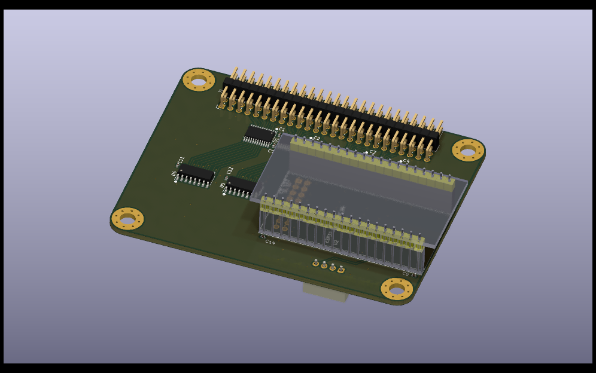
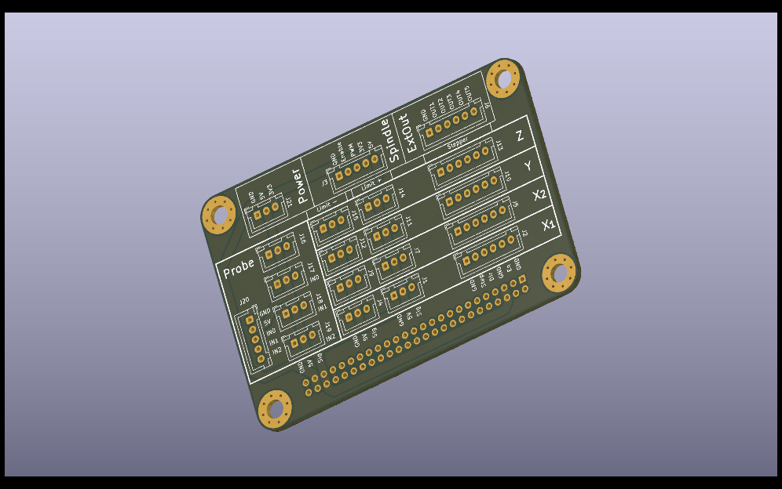

# CBC-Mill

This is my first try to build a CNC-Mill

As a controller I use an ESP-32 with
[FluidNC](https://github.com/bdring/FluidNC)

I designed a PCB with the following features:
- 4 stepper motors (for the X1,X2,Y,Z axes)
- 1 spindle output (enable+pwm)
- 5 additional output pins
- 8 limit switches (5V powered), 2 for each axis
- 1 probe switch
- 3 additional input pins
- 1 SD-Card
- 1 I2C (for an OLED display)

This board gets connected using a 2x25 pin header to a connector-board
with many JST-XH connectors. This board contians also pull-up resistors
for each input switch (all inputs are active-low)

